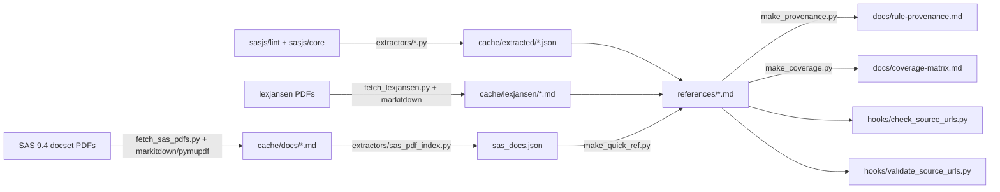

# Building sas94-skill

Pipeline and contributor guide for `sas94-skill`. Explains how shipped
content (`SKILL.md`, `references/*.md`, `assets/*.sas`) is sourced,
distilled, and kept truthful — and how to refresh it when upstream sources
move.

Audience: external SAS experts contributing content, future maintainers
pulling new `sasjs/lint` / `sasjs/core` SHAs or refreshing SAS docs, and
other Claude Code skill authors adopting this pattern for their own
under-represented-language skills.

For rule-authoring conventions (frontmatter, Quick Ref link text, PR
checklist) see [`CONTRIBUTING.md`](CONTRIBUTING.md). This file covers the
build system.

## Why this exists

SAS 9.4 is under-represented in LLM training corpora; stock Claude
produces SAS that looks plausible but misses silent-failure patterns
(MERGE overwrite, LAG-inside-IF, unnamed `%mend`, implicit `DIST=NORMAL`
in `PROC GENMOD`). The skill closes that gap by distilling rules and
idioms from:

- **MIT-licensed GitHub** — `sasjs/lint` (15 rules + spec.ts CORRECT/WRONG
  pairs) and `sasjs/core` (~150 Doxygen-headed base macros), pinned by
  SHA in [`pipeline/sources.yaml`](../pipeline/sources.yaml).
- **Named-author conference papers** on lexjansen.com — Dorfman (hash),
  Lafler (PROC SQL), Whitlock (macro quoting), Lepp (`/*/STORE SOURCE*/`).
- **SAS 9.4 official docs** — fetched as per-docset PDFs, not React-SPA
  HTML (the SPA renders client-side and 404s on curl).

Two design commitments:

1. **Every rule, idiom, or hygiene entry cites its upstream source URL.**
   A pre-commit hook blocks commits missing a `Source:` line within 5
   lines of any `### Rule` / `### Idiom` / `### Hygiene` heading; CI
   validates the URL resolves.
2. **Pipeline scripts are build-only, never shipped.** Users installing
   via `git clone` get `SKILL.md`, `references/`, `assets/` only;
   `pipeline/`, `docs/design.md`, and `evals/` are excluded via
   [`.skillignore`](#skill-install-exclusion).

## Source tier summary

Adapted from [`docs/design.md`](design.md) §Pipeline. Every reference-file
claim must trace to one of these tiers; the lower the tier number, the
stronger the authority.

| Tier | Source | License | Feeds |
|------|--------|---------|-------|
| 1 | [`sasjs/lint`](https://github.com/sasjs/lint) (15 rules + spec.ts); SHA pinned | MIT | Critical Rules, Silent Pitfalls, Anti-patterns |
| 1 | [`sasjs/core`](https://github.com/sasjs/core) (~150 base macros); SHA pinned | MIT | Canonical Idioms, Quick Ref, macro-shape Rules |
| 1 | [`jphall663/GWU_data_mining`](https://github.com/jphall663/GWU_data_mining) — hand-transcribed to `pipeline/manual/gwu-data-mining-5-items.md` | MIT | 5 items (LAG trap, MERGE overwrite, PROC APPEND, SQL join, macro quoting) |
| 2 | SAS 9.4 docset PDFs (`documentation.sas.com`) — querystring link form | SAS ToU, transformative | Quick Ref Doc URLs |
| 2 | [lexjansen.com](https://www.lexjansen.com) SUGI/PharmaSUG/SGF PDFs — markitdown-converted | Author-owned | Silent Pitfalls, Anti-patterns, Idioms |
| 3 | SAS Communities, Stack Overflow `sas` tag — tertiary, flagged | Varies | Silent Pitfalls (community-sourced) |

**Transformative-use discipline.** Every reference-file rule body quotes
**≤90 verbatim words** from any single upstream source, composes CORRECT /
WRONG examples fresh in claims/healthcare domain flavor (member_id,
paid_amt, index_dt, …), and links the source URL so reviewers can verify
against primary evidence. This is what keeps the content defensible under
SAS ToU and under author copyright on any lexjansen paper. See
[Transformative-use guardrails in practice](#transformative-use-guardrails-in-practice)
for the operational checks.

## Pipeline directory layout

```text
pipeline/
├── pyproject.toml            # uv-managed Python deps (httpx, markitdown,
│                             # pymupdf, beautifulsoup4, pydantic, pyyaml)
├── uv.lock                   # pinned for reproducibility
├── sources.yaml              # declarative seed: per-file source lists
├── _common.py                # REPO_ROOT, load_frontmatter, body_after_frontmatter
├── fetch_lexjansen.py        # SUGI / PharmaSUG / SGF PDFs → markdown
├── fetch_sas_pdfs.py         # SAS 9.4 docset PDFs → markdown (SPA-free)
├── make_provenance.py        # references/*.md → docs/rule-provenance.md
├── make_coverage.py          # references/*.md → docs/coverage-matrix.md
├── make_quick_ref.py         # fills Doc URL cells in macros.md / data-step.md
├── extractors/
│   ├── sas_pdf_index.py      # SAS PDFs → cache/extracted/sas_docs.json (1217 constructs)
│   ├── sasjs_lint.py         # lint rule source files → JSON
│   ├── sasjs_lint_specs.py   # lint spec.ts CORRECT/WRONG pairs → JSON
│   ├── sasjs_core_doxygen.py # Doxygen headers from base macros → JSON
│   └── sasjs_core_lint.py    # sasjs/core's own .sasjslint config → JSON
├── hooks/
│   ├── check_source_urls.py  # pre-commit: Source-URL-within-5-lines invariant
│   └── validate_source_urls.py  # CI: HEAD every URL, fail on 404
├── manual/
│   └── gwu-data-mining-5-items.md  # hand-transcribed GWU items
└── cache/                    # gitignored — reproducibility via SHAs, not snapshots
    ├── github/               # local clones of sasjs/lint, sasjs/core
    ├── docs/                 # SAS docset PDFs + .md conversions
    ├── lexjansen/            # conference PDFs + .md conversions
    └── extracted/            # JSON artifacts emitted by extractors/
```

### Data flow



### Per-script scope

- [`fetch_lexjansen.py`](../pipeline/fetch_lexjansen.py) — downloads a
  hardcoded seed list of SUGI / PharmaSUG / SGF PDFs, runs markitdown over
  them. Current seeds: Dorfman (SUGI 30, NESUG 2007, SESUG 2015), Lafler
  (WUSS 2011, SGF 2011, MWSUG 2015), Whitlock (NESUG 2009 macro quoting),
  Lepp (PharmaSUG 2019 SM04). Discovery is not attempted — lexjansen
  index pages are brittle. Hardcoded seeds are auditable; a scraper is
  not.
- [`fetch_sas_pdfs.py`](../pipeline/fetch_sas_pdfs.py) — downloads SAS 9.4
  docset PDFs from
  `documentation.sas.com/api/collections/pgmsascdc/<ver>/docsets/<name>/content/<name>.pdf`.
  Version fallback `9.4_3.4 → 9.4_3.5 → v_001`. Eight docsets (`mcrolref,
  lestmtsref, lefunctionsref, leforinforref, odsug, statug, proc, lepg`).
  Uses `pymupdf` (streaming) over markitdown for files >400 MB —
  pdfminer.six OOMs on `statug.pdf` (608 MB / 928 pages).
- [`extractors/sas_pdf_index.py`](../pipeline/extractors/sas_pdf_index.py) —
  indexes PDF headings into `cache/extracted/sas_docs.json` (1217
  constructs — functions, statements, procs, formats — with canonical
  landing-page URLs).
- [`make_quick_ref.py`](../pipeline/make_quick_ref.py) — fills
  `TODO (source pending)` cells in the Quick Ref tables of `macros.md`
  and `data-step.md` from `sas_docs.json`. Unindexed constructs (e.g.
  `_N_`, `_ERROR_` — automatic variables, no landing page) keep the TODO
  marker; URLs are never fabricated.
- [`make_provenance.py`](../pipeline/make_provenance.py) — walks
  `references/*.md`, captures `### Rule`, `### Idiom`, `### Hygiene`
  headings + their `Source:` line, emits
  [`docs/rule-provenance.md`](rule-provenance.md) sorted deterministically
  (file → section → rule_num → kind). Byte-identical output on re-run.
- [`make_coverage.py`](../pipeline/make_coverage.py) — emits
  [`docs/coverage-matrix.md`](coverage-matrix.md) tracking the 5 REQUIRED
  and 2 OPTIONAL template sections per reference file. A lone
  `TODO (source pending)` line does not count as populated.
- [`hooks/check_source_urls.py`](../pipeline/hooks/check_source_urls.py) —
  stdlib-only pre-commit hook (runs before `uv sync`). Enforces the
  Source-URL-within-5-lines invariant.
- [`hooks/validate_source_urls.py`](../pipeline/hooks/validate_source_urls.py) —
  CI link-checker. Async `httpx.head()` over every URL in
  `references/*.md` + `docs/rule-provenance.md`. Accepts 403 from
  CDN-fronted docs (bot-UA quirk); fails on any other 4xx/5xx or network
  error.
- [`_common.py`](../pipeline/_common.py) — shared helpers: `REPO_ROOT`,
  `REFERENCES_DIR`, `load_frontmatter()`, `body_after_frontmatter()`.

### `sources.yaml` — declarative per-file seed

The manifest is a YAML list; each entry maps one reference file to the
upstream sources that seed its content. Excerpt from
[the actual file](../pipeline/sources.yaml):

```yaml
- target: macros.md
  github:
    - repo: https://github.com/sasjs/lint
      tag: v2.4.3
      sha: 6172b3a64125db6995509d4e5102f2c41b9e4294
      path: src/rules/**/*.ts
      scope: "Macro-related lint rules"
    - repo: https://github.com/sasjs/core
      tag: v4.63.0
      sha: 3a54b9c796c0bfe477d1aefc1e22b9ff9f2c96c2
      path: base/*.sas
      scope: "Doxygen-headed base macros — idiom corpus"
  official_docs: []
  lexjansen: []
  community: []
```

Phase 1 (v0.0.1) pins SHAs for `macros.md` and `data-step.md` only;
the remaining 11 reference files carry empty lists and will populate in
`v0.0.2+`.

### Skill-install exclusion

[`.skillignore`](../.skillignore) at the repo root drops three paths from
the installed clone:

```text
pipeline/
docs/design.md
evals/
```

Everything else — `SKILL.md`, `references/`, `assets/`, the remaining
`docs/*.md` — ships with the skill. Keep `.skillignore` small; any path
you add is a surprise for users expecting a thin install.

## Quickstart for contributors

```bash
# Clone + sync deps + install hooks
git clone https://github.com/xiaosongz/sas94-skill.git
cd sas94-skill
uv --directory pipeline sync
uv tool install pre-commit && pre-commit install

# (Optional) confirm the network path resolves GitHub + lexjansen +
# documentation.sas.com before you start editing.
uv --directory pipeline run python hooks/validate_source_urls.py

# After editing any references/*.md, regenerate audit artifacts and commit.
uv --directory pipeline run python make_provenance.py > docs/rule-provenance.md
uv --directory pipeline run python make_coverage.py > docs/coverage-matrix.md
git add references/<file>.md docs/rule-provenance.md docs/coverage-matrix.md
git commit -m "<type>: <description>"
```

### Adding a new rule with a new source URL

Each new rule follows the reference-file template in
[`docs/design.md`](design.md) §Reference file template — a one-line
imperative heading, a `Source:` line, 1-2 sentences of "why," a CORRECT
SAS block, and a WRONG SAS block (5-15 lines each, in claims/healthcare
flavor). After editing, regenerate `docs/rule-provenance.md` +
`docs/coverage-matrix.md`, bump the file's `last_reviewed:` frontmatter,
and open a PR. The PR template in [`CONTRIBUTING.md`](CONTRIBUTING.md)
carries the reviewer checklist; the pre-commit hook blocks missing
Source lines; CI runs the link validator against the new URL.

Reviewers verify the URL resolves, the claim is genuinely supported by
the cited page (not adjacent material), examples are SAS 9.4-valid, and
the ≤8-rules-per-file + ≤90-verbatim-words budgets hold.

## How to refresh SAS-doc scrapes when SAS releases a new Mx

SAS 9.4 is in maintenance mode (last Mx: 2024), but when a new docset
revision ships the Quick Ref URLs must re-resolve against the new version:

1. Prepend the new CDC version to `VERSION_FALLBACKS` in
   [`pipeline/fetch_sas_pdfs.py`](../pipeline/fetch_sas_pdfs.py) (keep
   older versions as fallbacks for docsets that didn't re-cut).
2. Run the pipeline:

```bash
uv --directory pipeline run python fetch_sas_pdfs.py
uv --directory pipeline run python extractors/sas_pdf_index.py
uv --directory pipeline run python make_quick_ref.py
uv --directory pipeline run python hooks/validate_source_urls.py
```

Caches at `pipeline/cache/docs/` are gitignored — delete the cache to
force a full re-download; keep it to re-convert only changed bytes.

**Link-form discipline.** SAS doc URLs MUST use the querystring form:

```text
https://documentation.sas.com/?cdcId=pgmsascdc&cdcVersion=9.4_3.5&docsetId=<ds>&docsetTarget=<page>.htm
```

Do NOT use the path form
(`https://documentation.sas.com/doc/en/<docset>/9.4/<docset>.htm`) — it
breaks on docset rename and CDC version bump. The validator flags it.

## How to add a new lexjansen paper

1. Append a `SeedPaper` entry to the `SEEDS` tuple in
   [`pipeline/fetch_lexjansen.py`](../pipeline/fetch_lexjansen.py)
   (author, conference, URL, topic cluster, stable slug).
2. Run the fetcher — cache lands at
   `pipeline/cache/lexjansen/<slug>.{pdf,md}`; idempotent.
3. Hand-curate an Idiom / Rule / Hygiene entry in the appropriate
   `references/*.md` (`idioms-from-lexjansen.md` for cross-cutting
   patterns, the topic file otherwise). Every new heading needs a
   `Source:` line.
4. Regenerate `docs/rule-provenance.md` and `docs/coverage-matrix.md`.

Lexjansen URLs are stable for NESUG, MWSUG, SESUG, WUSS, and PharmaSUG
proceedings. SAS Global Forum paths (`support.sas.com/resources/papers/...`)
rotate occasionally — check lexjansen for an archived copy before
removing a 404'd SGF URL.

## Hook and CI details

### Pre-commit ([`.pre-commit-config.yaml`](../.pre-commit-config.yaml))

- `trailing-whitespace`, `end-of-file-fixer`, `check-yaml`,
  `check-added-large-files` (1024 KB cap) — stock hygiene.
- `check-source-urls` (local) — Source-URL-within-5-lines invariant on
  staged `references/*.md`.
- `markdownlint-cli2` with [`.markdownlint.json`](../.markdownlint.json) —
  code-fence rules relaxed for SAS examples.

Phase 1 contemplated auto-regen pre-commit hooks for
`docs/rule-provenance.md` + `docs/coverage-matrix.md`, but ordering with
the standard fixers was subtle enough that we catch stale audit artifacts
in CI instead. Revisit in v0.0.2+.

### GitHub Actions

- [`validate-sources.yml`](../.github/workflows/validate-sources.yml) —
  Monday 06:00 UTC cron + any PR touching `references/**/*.md` or
  `docs/rule-provenance.md`. Runs `validate_source_urls.py`.
- [`check-skill-load.yml`](../.github/workflows/check-skill-load.yml) —
  on any PR touching `SKILL.md` or `references/**`. Parses `SKILL.md`
  frontmatter (requires `name`, `description`), confirms every routing-
  table filename exists on disk, enforces a floor of 11 reference files.
- [`lint-markdown.yml`](../.github/workflows/lint-markdown.yml) —
  markdownlint over `*.md` (excluding `pipeline/cache/**`, `docs/design.md`)
  plus a per-reference-file size check: warn >20 KB, fail >40 KB.

### No skipping hooks

`--no-verify` is forbidden. Fix the underlying issue (missing Source URL,
stale provenance, oversized reference file) and re-stage.

## Transformative-use guardrails in practice

**Verbatim-word count.** Before merging a new rule or idiom, open the
upstream source side-by-side and count the longest verbatim run. Hard cap:
**90 words from any single source** in any one reference-file entry. A
typical Rule body (why + CORRECT + WRONG) sits at 40-70 words of prose
plus fresh code blocks, well inside the cap.

**Code examples in claims/healthcare flavor.** The target audience runs
Medicaid claims analyses, cohort-building from MiHYST enrollment, and
survey-weighted mortality regressions. CORRECT / WRONG examples should use
`member_id`, `enroll_dt`, `paid_amt`, `dx_cd`, `index_dt`,
`followup_days` — not the generic `name`/`salary`/`dept` flavor from SAS
docs. This keeps examples transformative under SAS ToU and makes the skill
directly useful for the audience it targets.

**What not to do.** Do not copy-paste a SAS doc paragraph as-is (citation
is necessary but not sufficient); do not embed a verbatim `sasjs/core` base
macro longer than 90 words (link to it instead); do not cite a lexjansen
paper without reading it — the reviewer checklist asks whether the source
genuinely supports the claim, and that check requires reading the page.

## When the pipeline doesn't apply

Not every edit requires a pipeline re-run. Skip regen when the edit doesn't
touch generator inputs:

- **Typo fixes** — just fix and commit.
- **`last_reviewed:` frontmatter bumps** — include in the same PR as any
  content edit.
- **Cross-file See-Also repairs** — manual grep + edit; there is no
  tooling for See-Also link integrity yet.
- **README / CONTRIBUTING edits** — not generator inputs.

Re-run the regenerators when you:

- Add, remove, or rename a `### Rule` / `### Idiom` / `### Hygiene`
  heading (triggers `make_provenance.py` + `make_coverage.py`).
- Flip a section's populated/stub status (triggers `make_coverage.py`).
- Add a new SAS-doc URL outside `make_quick_ref.py`'s output — run the
  link validator against it before pushing.

## Reusing this pattern for other skills

Authors of skills for other under-represented languages (PROC IML, SAS
Viya, Stata, niche R packages) can adapt this repo as a template. The
transferable skeleton:

1. **Source-tier discipline** in `docs/design.md` — Tier 1 machine-readable
   MIT source pinned by SHA, Tier 2 official docs + named-author papers,
   Tier 3 forums flagged and sparing.
2. **Verbatim-word cap** per rule (90 works for SAS; pick what fits your
   upstream's licensing), documented in `CONTRIBUTING.md`.
3. **Deterministic regenerators** for provenance and coverage — re-running
   must produce byte-identical output.
4. **Stdlib-only pre-commit hook** enforcing the Source-URL invariant (so
   it runs before the pipeline's `uv sync`).
5. **Per-file-scope `sources.yaml`** listing upstream repos + SHAs + URLs
   per reference file.
6. **`.skillignore`** to keep the pipeline out of the shipped clone.

Not transferable: the SAS-specific pieces in `fetch_sas_pdfs.py` (docset
names, CDC version string), the TypeScript-parsing extractors in
`extractors/sasjs_*.py`, and the SAS-doc Quick Ref link-text convention.
The skeleton carries over; the extractors do not.

## Verification

Before opening a PR against `main`:

```bash
# Pre-commit: all 6 hooks must pass.
pre-commit run --all-files

# Link validator: exit 0; ~60-90s wall time for a full sweep.
uv --directory pipeline run python hooks/validate_source_urls.py

# Regenerators must produce zero diff against committed artifacts.
uv --directory pipeline run python make_provenance.py > /tmp/prov.md
diff docs/rule-provenance.md /tmp/prov.md
uv --directory pipeline run python make_coverage.py > /tmp/cov.md
diff docs/coverage-matrix.md /tmp/cov.md
```

If any fail, fix the underlying issue (stale provenance, broken link,
missing Source URL) and re-run.

## See also

- [`README.md`](../README.md) — public-facing install + usage
- [`docs/design.md`](design.md) — architecture spec (not shipped)
- [`docs/CONTRIBUTING.md`](CONTRIBUTING.md) — reviewer workflow + PR /
  issue templates + frontmatter + Quick Ref link-text rules
- [`docs/coverage-matrix.md`](coverage-matrix.md) — auto-generated
- [`docs/rule-provenance.md`](rule-provenance.md) — auto-generated
- [`docs/EVALS.md`](EVALS.md) — evaluation harness architecture
- [`pipeline/README.md`](../pipeline/README.md) — terse run-commands companion
